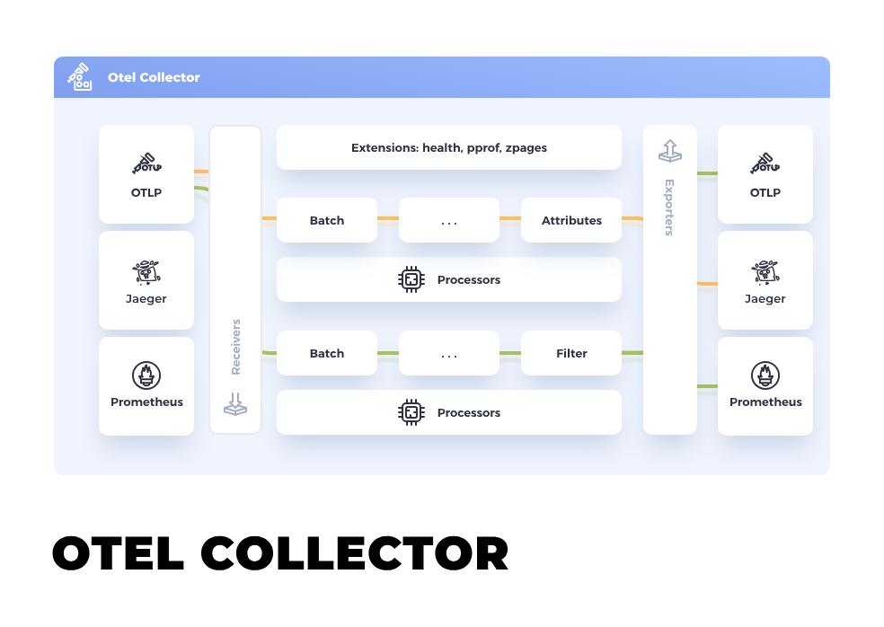

# Oracle Cloud Infrastructure OpenTelemetry Integration

---

## Overview

Let's take a look at bringing Oracle Cloud Infrastructure (OCI)’s rich observability data to OpenTelemetry-compatible
3rd party systems.  These function samples show how to perform simple JSON-to-JSON transformation of the OCI log and 
metric events to OpenTelemetry's API contract.  Transformed messages are then sent to an `OTEL Collector`. 

See the [OTEL Collector Documentation](https://opentelemetry.io/docs/collector/)
and [QuickStart](https://opentelemetry.io/docs/collector/quick-start/).

### Using the HTTP Protocol

The sample functions use HTTP protocol to connect with the collector.  Here is a sample collector config YAML.

[otel-collector-config.yaml](./otel-collector-config.yaml)

---

---
### [Exporting OCI Logs to OTEL Collectors](oci-log-otel/README.md)
### [Exporting OCI Metrics to OTEL Collectors](oci-metrics-otel/README.md)
### [Enriching Logs and Metrics with OCI Tags](oci-tag-enrich/README.md)
