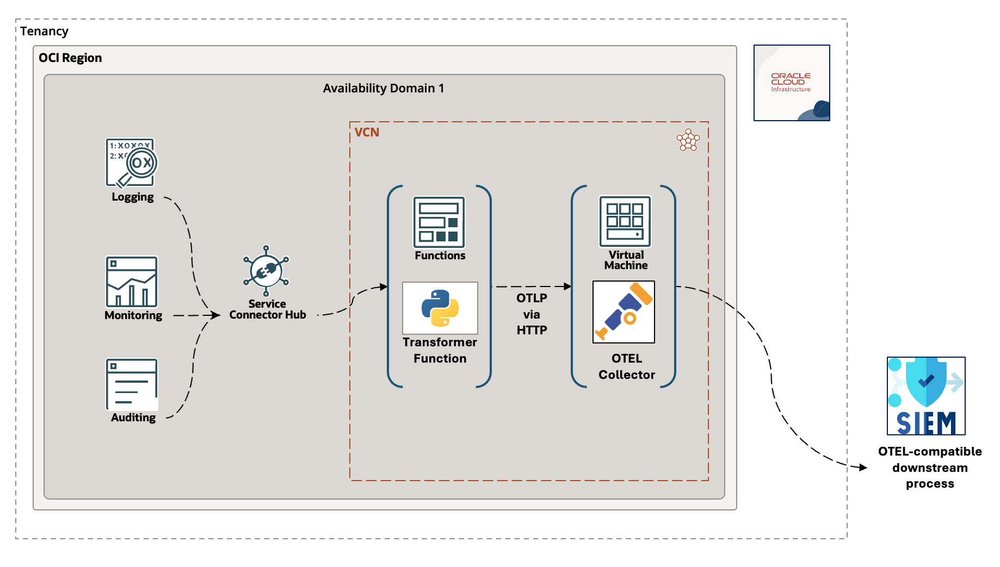

# Exporting OCI Monitoring Service Metrics to OTEL Collectors

---
## Solution Architecture

Here is the basic architecture and flow of data from beginning to end:

* OCI services emit metric data which is captured by the `Monitoring Service`.
* The Monitoring Service feeds metric data events to a `Service Connector`.
* The `Service Connector` invokes a `Function` which transforms the metric data payload to `OpenTelemetry` protobuf messages format and posts the transformed payload to the `OTEL Collector` REST API.
* The `OTEL Collector` ingests the metrics, forwarding them on to downstream `SIEM` / monitoring.

--- 

---

## OpenTelemetry Metrics Specification

* [Metrics Specification](https://github.com/open-telemetry/opentelemetry-specification/tree/main/specification/metrics)
* [Metrics Data Model](https://github.com/open-telemetry/opentelemetry-specification/blob/main/specification/metrics/data-model.md)

---
## Monitoring Service

 The [Monitoring Service](https://docs.oracle.com/en-us/iaas/Content/Monitoring/Concepts/monitoringoverview.htm)
 receives timestamp-value pairs (aka metric data points) which also carry contextual 
dimensions and metadata about the services or applications that emitted them. 

---
## Service Connector Hub

The stream of Metric data is event-driven and must be handled on-demand and at scale. The 
[Service Connector Hub](https://docs.oracle.com/en-us/iaas/Content/service-connector-hub/overview.htm) does
exactly that.  See [Service Connector Hub documentation](https://docs.oracle.com/en-us/iaas/Content/service-connector-hub/overview.htm) for details.

---
## Functions Service

I need to transform between the raw metrics formats and some way to make the OTEL Connector API calls. The 
[OCI Functions Service](http://docs.oracle.com/en-us/iaas/Content/Functions/Concepts/functionsoverview.htm) is a 
natural fit for the task. Functions integrate nicely with Service Connector Hub as a target and can scale up
depending on the demand.  That lets me focus on writing the logic needed without needing to address how to 
deploy and scale it.

---
## Mapping From OCI to OpenTelemetry Formats

A key requirement of course is the mapping of OCI to OpenTelemetry format.  Let's compare the OCI and OpenTelemetry
message payload formats, what the mapping needs to accomplish, and see what the resulting transformed message 
looks like.

#### Example OCI Metrics Payload:
    
      {
        "namespace": "oci_vcn",
        "resourceGroup": null,
        "compartmentId": "ocid1.compartment.oc1....",
        "name": "VnicEgressDropsConntrackFull",
        "dimensions": {
          "resourceId": "ocid1.vnic.oc1.phx...."
        },
        "metadata": {
          "displayName": "Egress Packets Dropped by Full Connection Tracking Table",
          "unit": "packets"
        },
        "datapoints": [
          {
            "timestamp": 1652196492000,
            "value": 0.0,
            "count": 1
          }
        ]
      }

#### Map these OCI keys to OTEL attributes:

    OTEL_METRIC_RESOURCE_ATTR_MAP = 'dimensions compartmentId'
    OTEL_METRIC_SCOPE_ATTR_MAP = 'namespace'
    OTEL_DATAPOINT_ATTR_MAP = 'count'

Notice that `dimensions` is itself an object in the OCI payload.  All contents of the
dimensions object will be copied.

#### Resulting OTEL Output:

      {
        "resourceMetrics": [
          {
            "resource": {
              "attributes": [
                {
                  "key": "resourceId",
                  "value": {
                    "stringValue": "ocid1.vnic.oc1.phx...."
                  }
                },
                {
                  "key": "compartmentId",
                  "value": {
                    "stringValue": "ocid1.compartment.oc1....."
                  }
                },
                {
                  "key": "resourceGroup"
                }
              ]
            },
            "scopeMetrics": [
              {
                "scope": {
                  "attributes": [
                    {
                      "key": "namespace",
                      "value": {
                        "stringValue": "oci_vcn"
                      }
                    }
                  ]
                },
                "metrics": [
                  {
                    "name": "VnicEgressDropsConntrackFull",
                    "description": "Egress Packets Dropped by Full Connection Tracking Table",
                    "unit": "packets",
                    "gauge": {
                      "dataPoints": [
                        {
                          "startTimeUnixNano": "1652196492000",
                          "asDouble": 0.0,
                          "attributes": [
                            {
                              "key": "count",
                              "value": {
                                "intValue": "1"
                              }
                            }
                          ]
                        }
                      ]
                    }
                  }
                ]
              }
            ]
          }
        ]
      }

---
## Policy Setup

You will need 
this [IAM policy](https://docs.oracle.com/en-us/iaas/Content/Functions/Tasks/functionscreatingpolicies.htm#Create_Policies_to_Control_Access_to_Network_and_FunctionRelated_Resources) 
to authorize the Service Connector to invoke your Function.

    allow any-user to use fn-function in compartment id ocid1.compartment.oc1... where all {request.principal.type=’serviceconnector’, request.principal.compartment.id=’ocid1.compartment.oc1...’}

---
## Function Environment

Here are the supported Function parameters.

The Maps discussed here indicate what OCI values to transfer and where to copy them in the OTEL message.
space-separated event data keys instruct what OCI values to transfer and where attribute them.  Scalars or complete objects can be mapped)

| Environment Variable      |         Default          | Purpose                                                                                                                                                                                                                 |
|---------------------------|:------------------------:|:------------------------------------------------------------------------------------------------------------------------------------------------------------------------------------------------------------------------|
| OTEL_COLLECTOR_METRICS_API_ENDPOINT |      not-configured      | This is an HTTP protocol address with port, reachable from the Function Service. Note that the [otel-collector-config.yaml](../otel-collector-config.yaml) must have HTTP protocol enabled.                                                                                                                                                                                                                        |
| OTEL_METRIC_RESOURCE_ATTR_MAP             | dimensions compartmentId | mapping: transfer dimensions (entire object) and compartmentId to Metric resource.  If you can add other keys here, use spaces only to delineate                                                                        |
| OTEL_METRIC_SCOPE_ATTR_MAP             |        namespace         | mapping: transfer namespace to Metric scope.                                                                                                                                                                            |
| OTEL_DATAPOINT_ATTR_MAP             |          count           | mapping: transfer namespace to Metric datapoint.                                                                                                                                                                        |
| RAISE_MISSING_MAP_KEY             |           True           | What happens if a mapped key is not found in the OCI payload?    Set this true to raise exception then a mapped key is missing.                                                                                         |
| LOG_MISSING_MAP_KEY             |           True           | What happens if a mapped key is not found in the OCI payload?  Set this true to see what is missing.                                                                                                                    |
| LOG_RECORD_CONTENT             |          False           | Log the OCI and OTEL full record contents to OCI logging (not recommended in production!!)                                                                                                                              |
| LOGGING_LEVEL             |           INFO           |                                                                                                                                                                                                                         |

---
## License
Copyright (c) 2024, Oracle and/or its affiliates. All rights reserved.
Licensed under the Universal Permissive License v 1.0 as shown at https://oss.oracle.com/licenses/upl.
