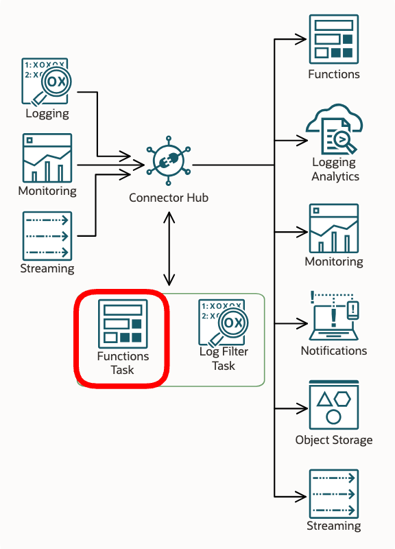
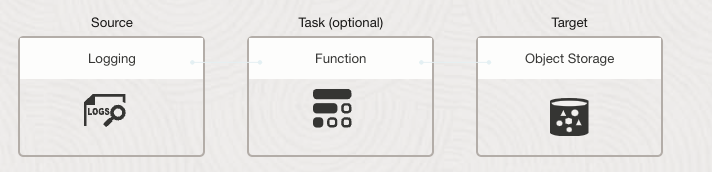

# Enriching Log and Metric Event Payloads with OCI Tags

---

### Why are Tags not Present on Log and Metric Events?

OCI supports a robust [Tagging](https://docs.oracle.com/en-us/iaas/Content/Tagging/Concepts/taggingoverview.htm) 
feature that allows customers to tag provisioned objects as needed to meet virtually any business use case.
However, most OCI services don't include OCI tags when they emit logs
and metrics to [Logging](https://docs.oracle.com/en-us/iaas/Content/Logging/home.htm) and 
[Monitoring](https://docs.oracle.com/en-us/iaas/Content/Monitoring/home.htm) 
because including tags would be expensive, adversely impacting storage and bandwidth usage.

### Observability Correlation Use Cases

Many customer use cases, however, call for a way to map log and metric events to business objects so 
that downstream Observability systems can perform required correlative analyses.  Thus, they need
events with tags included.

### Solution Brief

This sample solves that problem through the use of
[OCI Service Connector Function Tasks](https://docs.oracle.com/en-us/iaas/Content/connector-hub/overview.htm). 
The sample Function Task "enriches" an event by selectively retrieving and adding tags to each as 
the Service Connector processes them. 

See [OCI Service Connector Overview](https://docs.oracle.com/en-us/iaas/Content/connector-hub/overview.htm) for 
a thorough explanation of Functions Tasks.



----


## Functions Primer

If you’re new to Functions, get familiar by running through 
the [Quick Start guide on OCI Functions](http://docs.oracle.com/en-us/iaas/Content/Functions/Tasks/functionsquickstartguidestop.htm) before proceeding.


## IAM Setup

### OCI Compartment

For illustration purposes, we will define a compartment with the name `tag-enrichment-comp`.


### OCI Policy

Since the functions task uses the OCI SDK to retrieve tags, it will need permissions to do so.  

#### Dynamic Group

Functions are resources in OCI IAM parlance, do we need to set up a dynamic group called `tag-enrichment-dynamic-group` 
that includes function resources in the compartment.  The ocid should be the one corresponding to `tag-enrichment-comp`.

```
resource.compartment.id = 'ocid1.compartment.oc1....'
```

#### Policies

Next we need to grant the task the ability to search the various types of OCI resources we have in our use case.
In the below example, some sample permissions are present as a guide.  For example, your function may need to 
retrieve the tags for VCNs, subnets, buckets and objects in `tag-enrichment-comp`, or it may need to get tags for 
any resource in the compartment.  Adjust this as needed for your use case.

```
Allow dynamic-group tag-enrichment-dynamic-group to use tag-namespaces in compartment tag-enrichment-comp
Allow dynamic-group tag-enrichment-dynamic-group to manage object-family in compartment tag-enrichment-comp
Allow dynamic-group tag-enrichment-dynamic-group to manage virtual-network-family in compartment tag-enrichment-comp
Allow dynamic-group tag-enrichment-dynamic-group to manage all-resources in compartment tag-enrichment-comp
Allow dynamic-group tag-enrichment-dynamic-group to manage compartments in compartment tag-enrichment-comp
```

## Function Setup

See the [Quick Start guide on OCI Functions](http://docs.oracle.com/en-us/iaas/Content/Functions/Tasks/functionsquickstartguidestop.htm) reference.
This task supports a number of configuration options (see below).

### Selecting Target OCIDs

The main configuration parameter the task needs is the list of **target OCID keys** it will search for
in the event payloads.
Set the `TARGET_OCID_KEYS` configuration parameter to a comma-separated list of OCID keys that will be present in the event
payloads.  

**Notes**
* Target OCIDs can exist anywhere in the event payload, and will be found regardless of nested position.
* If the same target OCID key exists multiple times in an event payload, only the first one will be mapped.
* The default `TARGET_OCID_KEYS` values are just examples. You will most likely need to customize this configuration parameter.   


### Function Testing

Once you have the Fn Application created, Function built and deployed to the Application, we can perform some tests
from the cloud shell without having to set up a Service Connector.

Add a freeform tag to the VCN you created for the Fn Application.  An example freeform tag:

    "app-test": "working" 

We will invoke the function by passing it a simulated event payload that looks like this:

    {
      "vcnId": "ocid1.vcn.oc1.iad...."
    }

You should see the same payload returned with `tags` added ... something like this:

    {
      "vcnId": "ocid1.vcn.oc1.iad....",
      "tags": {
         "ocid1.vcn.oc1.iad....": {
            "freeform": {
               "VCN": "VCN-2023-12-19T19:10:27",
               "app-test": "working"
            }
         }
      }
    }

Now let's invoke the Function from the directory in cloud shell where the function code is located, 
passing in a simulated 'event' payload like so:

    echo -n '{"vcnId":"your-vcn-id-goes-here"}' | fn invoke tag-enrichment-app oci-tag-enrichment-task


## Service Connector Setup

As a sample test scenario, let's write enriched VCN Flow Logs to Object Storage.




**Configure VCN Tags**
* Just use the VCN that the Function App requires.
* Add freeform or defined tags to the subnets on your VCN in `tag-enrichment-comp`.

**Configure VCN Flow Logs**
* Enable VCN Flow logs for the VCN in `tag-enrichment-comp`.

**Configure Task**
* VCN Flow Logs include a `vnicsubnetocid` ocid key.  That exists by default in `TARGET_OCID_KEYS`.

**Create Object Storage**
* Create a bucket in `tag-enrichment-comp`.

**Create Service Connector**
* Create a service connector instance in `tag-enrichment-comp`.
* Configure it to:
  * Select VCN Flow Logs as Source
  * Select Functions Task to process each event
  * Select Object Storage as Target

_NOTE: BE SURE TO ACCEPT THE POLICY UPDATES THE SERVICE CONNECTOR DIALOG OFFERS YOU!_

## Troubleshooting

### Enabling logs

Enable the function invoke logs for the Function App.  If you are experiencing an unexpected behavior, 
set `LOGGING_LEVEL` to `DEBUG` to see the full scope of invoke logging output.

### Task function is timing out

You can reduce the amount of work passed to the Task Function to resolve this. Edit the Task portion of 
the Service Connector, click `Show additional options` and then `Use manual settings`. Set `Batch size limit (KBs)` 
to a smaller number to reduce the batch size.  Conversely, you can extend the time limit by 
increasing `Batch time limit (seconds)`.

### Task function is not adding the expected tags

Be sure you have the correct ocid keys in your `TARGET_OCID_KEYS`.  Use logging to confirm that task is searching 
for the ocid key.   

If the logs show the search API is being called for an ocid but nothing is returned, you probably are 
seeing an [auth issue](https://docs.oracle.com/en-us/iaas/Content/connector-hub/overview.htm#Authenti). Modify 
your policy to grant the Task resource appropriate access otherwise the search API calls will not return 
anything.

### Task function is adding stale tags

This function has a cache which it uses to avoid making unnecessary search API calls. You can clear the 
cache by changing the function configuration which will cause the SCH to reload the Function container 
... thus clearing the cache.

If the cache continues to creating issues, perhaps try
[replacing it with an expiring dictionary](https://pypi.org/project/expiring-dict/).  :-)

----

## Function Configuration Options

Here are the supported variables.  The defaults are fine for most use cases.

| Environment Variable  |                      Default                       | Purpose                                                                                                                                                                                                                                         |
|-----------------------|:--------------------------------------------------:|:------------------------------------------------------------------------------------------------------------------------------------------------------------------------------------------------------------------------------------------------|
| TARGET_OCID_KEYS                 | compartmentId,vcnId,subnetId,vnicId,vnicsubnetocid | Target OCIDs can exist anywhere in the event JSON payload, regardless of nested position.  Simply provide a comma-separated list of OCID keys (l-values) in the JSON.  The tags for each will be retrieved and added.                           |
| TARGET_OCID_KEYS_WARN_IF_NOT_FOUND |                       False                        | A superset of 'target_ocid_keys' may be declared to cover a wide variety of heterogeneous event types.  Default of False suppresses log warnings when a target ocid key is not found in the event payload.                                      |
| INCLUDE_FREEFORM_TAGS |                        True                        | Determine whether 'freeform' tags should be included.                                                                                                                                                                                           |
| INCLUDE_DEFINED_TAGS  |                        True                        | Determine whether 'defined' tags should be included.                                                                                                                                                                                            |
| INCLUDE_SYSTEM_TAGS   |                        True                        | Determine whether 'system' tages should be included.                                                                                                                                                                                            |
| TAG_ASSEMBLY_KEY   |                        tags                        | The assembly key is the dictionary key used to add tags to the event payload.                                                                                                                                                                   |
| TAG_ASSEMBLY_OMIT_EMPTY_RESULTS   |                        True                        | Determines whether empty tag dictionaries will be emitted for 'freeform', 'defined' or 'system' tag types when there are none found.  Downstream logic may expect to find these l-values even if empty. If that is the case, set this to False. |
| LOGGING_LEVEL         |                        INFO                        | Controls function logging outputs.  Choices: INFO, WARN, CRITICAL, ERROR, DEBUG                                                                                                                                                                 |

----
## **OCI** Related Workshops
LiveLabs is the place to explore Oracle's products and services using workshops designed to 
enhance your experience building and deploying applications on the Cloud and On-Premises.
ur library of workshops cover everything from how to provision the world's first autonomous 
database to setting up a webserver on Oracle's world-class OCI Generation 2 infrastructure, 
machine learning and much more.  Use your existing Oracle Cloud account, 
a [Free Tier](https://www.oracle.com/cloud/free/) account or a LiveLabs Cloud Account to build, test, 
and deploy applications on Oracle's Cloud.

Visit [LiveLabs](http://bit.ly/golivelabs) now to get started.  Workshops are added weekly, please visit frequently for new content.

## License
Copyright (c) 2014, 2023 Oracle and/or its affiliates
The Universal Permissive License (UPL), Version 1.0
